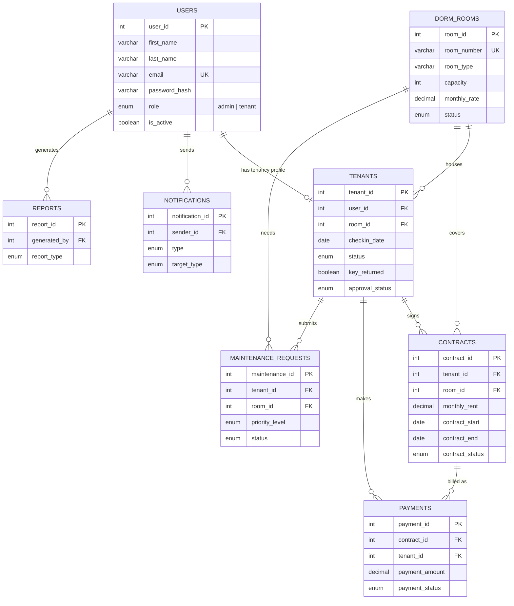
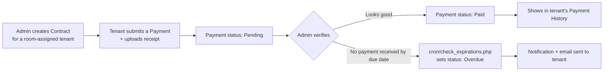

# System Diagrams

Paste any block below into [mermaid.live](https://mermaid.live) to preview it,
or view this file in VS Code with the "Markdown Preview Mermaid Support"
extension. GitHub also renders these natively if you push the repo there.

## Entity-Relationship Diagram

Reflects `database/schema.sql`. Note that **contracts** and **payments**
are two tables, not one — see the README's "Design decisions" section
for why.



## Login & Role-Routing Flowchart

Matches the system flowchart in the original documentation, extended
with the tenant-approval branch that the prototype's Track Tenant
Status screen implies.

```mermaid
flowchart TD
    A([User visits the system]) --> B{Has an account?}
    B -- No --> C[Register — role is always set to tenant]
    C --> D[(users + tenants rows created,\napproval_status = Pending)]
    D --> E[Login page]
    B -- Yes --> E[Login page]
    E --> F[Enter email + password]
    F --> G{password_verify() OK?}
    G -- No --> H[Show "incorrect email or password"]
    H --> E
    G -- Yes --> I{is_active?}
    I -- No --> J[Show "account deactivated"]
    I -- Yes --> K{role?}
    K -- admin --> L[Admin Dashboard]
    K -- tenant --> M{approval_status?}
    M -- Pending / Rejected --> N[Show "application under review" screen]
    M -- Approved --> O{room_id assigned?}
    O -- No --> P[Dashboard: "waiting for room assignment"]
    O -- Yes --> Q[Full Tenant Dashboard]
```

## Payment & Contract Lifecycle


